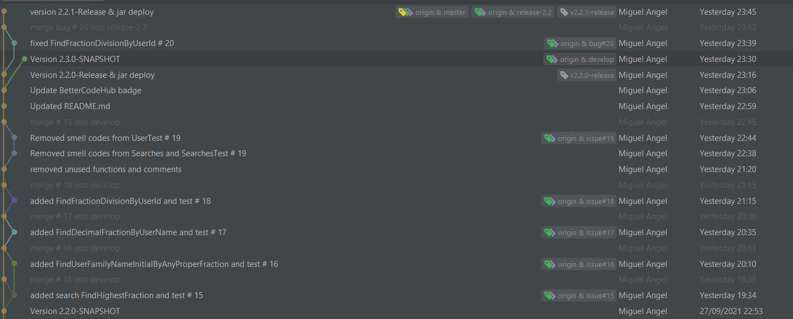
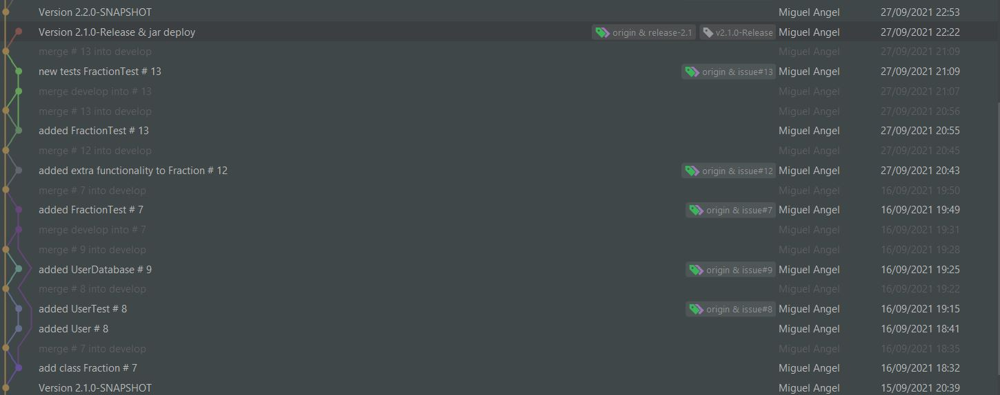
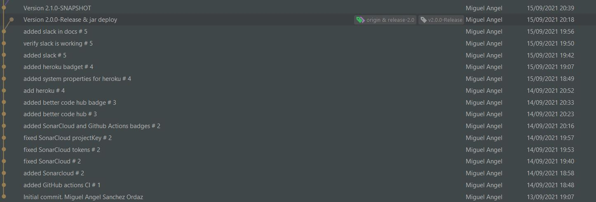

## [Máster en Ingeniería Web por la Universidad Politécnica de Madrid (miw-upm)](http://miw.etsisi.upm.es)
## Ingeniería Web: Visión General (IWVG) DevOps
### Miguel Ángel Sánchez Ordaz

### Descripción
Trabajo práctico realizado para la asignatura Ingeniería Web: Visión General (IWVG).

#### Búsquedas realizadas

1. Stream<String> findUserFamilyNameInitialByAnyProperFraction()
2. Fraction findFractionDivisionByUserId(String id)
3. Fraction findHighestFraction()
4. Stream<Double> findDecimalFractionByUserName(String name)

#### Grafo de git
##### Sprint 3

##### Sprint 2

##### Sprint 1

